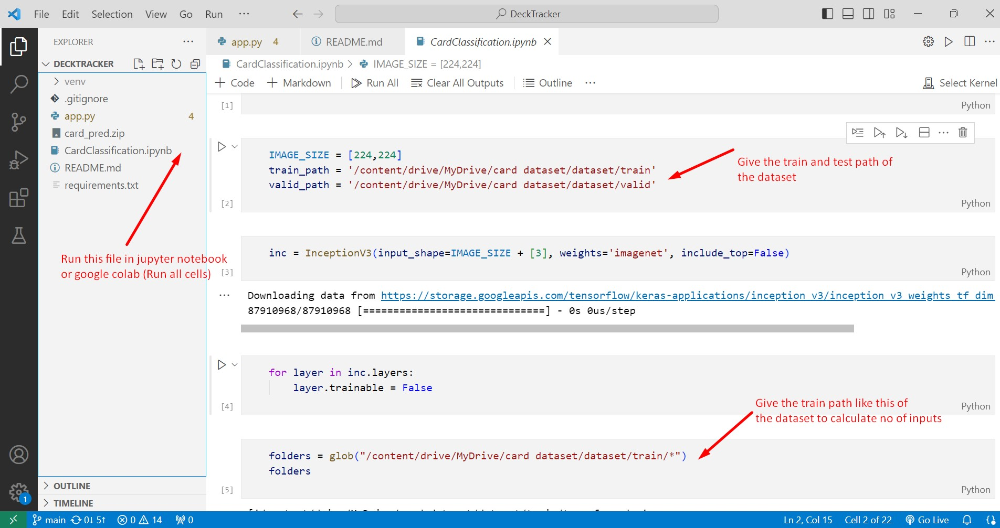
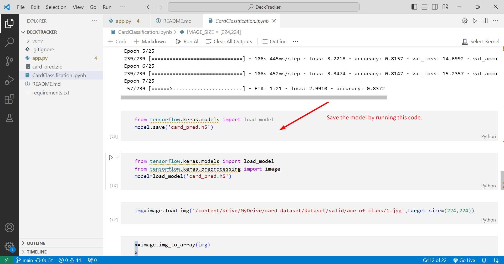
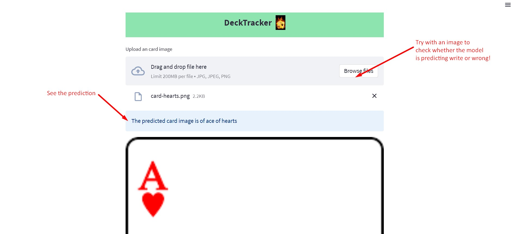

# Decktracker

Decktracker is a web app that classifies and identifies the type of playing cards using Convolutional Neural Networks (CNN) and Streamlit.

## Features

- Classify and identify playing cards using CNN.
- Streamlit-powered web interface for easy interaction.
- Intuitive design for a user-friendly experience.

## Running the App Locally

### Step 1: Run the CardClassification.ipynb file

### Step 2: Save the card_pred.h5 model.

### Step 3: Run the streamlit app

### Step 4: Upload Image and View Classification Result

## Dataset

You can download the dataset from [Kaggle](https://www.kaggle.com/datasets/gpiosenka/cards-image-datasetclassification).

